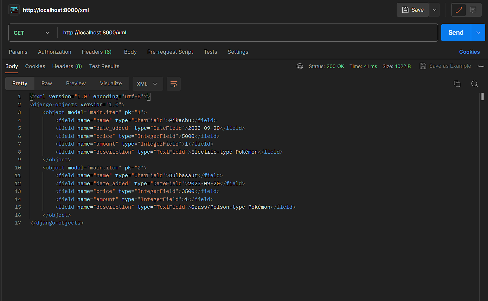

# Pembahasan Tugas-tugas PBP
Link Aplikasi: http://patrick-samuel-tugas.pbp.cs.ui.ac.id/
# Daftar Isi
* [Identitas](#identitas-penulis)
* [Tugas 2](#tugas-2)
* [Tugas 3](#tugas-3)
* [Tugas 4](#tugas-4)
# Identitas Penulis
Nama    : Patrick Samuel Evans Simanjuntak<br>
NPM     : 2206028251<br>
Kelas   : PBP C<br>

# Tugas 2
<details close>
<summary>Click here to see Tugas 2</summary>

## Daftar Isi Tugas 2
* [Langkah-langkah Pembuatan Aplikasi Django Baru](#langkah-langkah-pembuatan-aplikasi-baru)
* [Bagan Request Client dan Penjelasan](#bagan-request-client)
* [Alasan Penggunaan Python *Virtual Environment*](#alasan-penggunaan-python-virtual-environment)
* [*MVC*, *MVT*, dan *MVVM*](#mvc-mvt-dan-mvvm)

## Langkah-langkah Pembuatan Aplikasi Baru
Berikut adalah bagaimana saya mengimplementasikan aplikasi Pokemon Bo.
### Membuat sebuah proyek Django baru.
Pertama, saya membuat direktori lokal bernama **pokemon_bo** dan direktori git bernama **pokemon_bo**. Setelah itu, saya menghubungkan kedua direktori tersebut. Untuk persiapan pembuatan proyek Django, saya melakukan instalasi beberapa *dependencies*. Saya juga menggunakan Python *virtual environment* untuk membantu mengisolasi *dependencies* satu proyek dengan yang lainnya. Untuk membuat proyek Django-nya sendiri, saya menggunakan *syntax*:
```
django-admin startproject pokemon_bo .
```

### Membuat aplikasi dengan nama **main** pada proyek pokemon_bo
Kedua, saya membuat aplikasi **main** pada proyek pokemon bo dengan menggunakan *syntax*:
```
python manage.py startapp main
```
Syntax tersebut berfungsi untuk membuat suatu aplikasi "kosong" dan masih bersifat kerangka. Aplikasi yang dihasilkan berupa folder bernama **main** yang berisi beberapa file dengan format Python yang dibutuhkan untuk membuat suatu aplikasi. Setelah selesai membuat aplikasi **main**, saya menambahkan aplikasi tersebut ke dalam variabel **INSTALLED_APPS** untuk mendaftarkan aplikasi tersebut pada proyek **pokemon bo**.

### Melakukan routing pada proyek agar dapat menjalankan aplikasi main
Ketiga, saya membuka **urls.py** yang terdapat pada direktori proyek. Setelah itu, saya menambahkan kode berikut:
```
from django.contrib import admin
from django.urls import path, include

urlpatterns = [
    path('main/', include('main.urls')),
    path('admin/', admin.site.urls),
]
```
Berkas tersebut berfungsi untuk mengatur rute URL pada tingkatan proyek. Oleh karena itu, saya menambahkan "path('main/', include('main.urls'))" untuk mengarahkan *request* ke rute yang telah diatur pada berkas **urls.py** aplikasi **main**. Fungsi include sendiri berfungsi untuk mengimpor rute URL dari aplikasi menuju ke **urls.py** proyek.

### Membuat model pada aplikasi main dengan nama Item
Keempat, saya membuat suatu model pada aplikasi main, tepatnya pada **models.py**. Pembuatan model dilakukan untuk menentukan kerangka dari database yang berisi data-data yang akan dimuat oleh aplikasi nantinya. Pembuatan model dilakukan dengan membuat kelas Item yang merupakan turunan dari kelas **models.Model**. Di dalam kelas tersebut, saya menambahkan atribut seperti name, date_added, price, amount, description.

### Membuat sebuah fungsi pada views.py untuk dikembalikan ke dalam sebuah template HTML yang menampilkan nama aplikasi serta nama dan kelas saya
Kelima, saya membuka berkas views.py lalu melakukan import render yang berasal dari django.shortcuts. Setelah itu, saya membuat suatu fungsi bernama show_main dengan parameter **request**. Fungsi ini berguna untuk mengatur permintaan HTTP dan mengembalikan tampilan yang diinginkan HTTP. Di dalam kelas tersebut, saya menambahkan variabel **context** yang merupakan sebuah dictionary yang berisi dua key, yaitu name dan class. Key name memiliki value berupa nama saya dan key class memiliki value berupa kelas PBP saya. Terakhir, fungsi show_main ini akan melakukan return dengan memanggil fungsi render dengan *syntax*:
```
return render(request, "main.html", context)
```
Kode tersebut berguna untuk melakukan render tampilan dari main.html melalui pemanggilan fungsi render. Fungsi render sendiri memiliki tiga parameter. Parameter request merupakan objek dari pengguna yang berupa permintaan HTTP. Parameter main.html merupakan berkas yang berfungsi untuk melakukan render tampilan. Parameter context merupakan dictionary yang berguna untuk meneruskan data-data yang dimuat didalamnya untuk digunakan pada tampilan secara dinamis.

###  Membuat sebuah routing pada urls.py aplikasi main untuk memetakan fungsi yang telah dibuat pada views.py
Pertama, saya membuka berkas urls.py di dalam direktori main. Lalu, saya melakukan import beberapa library yang dibutuhkan, seperti path dan show_main.
```
from django.urls import path
from main.views import show_main
```
Setelah itu, saya menginstansiasi variabel app_name dengan value 'main'. 
```
app_name = 'main'
```
Hal ini dilakukan untuk membantu Django membuat penamaan URL masing-masing aplikasi secara unik untuk mencegah konflik pada URL antar aplikasi. Setelah itu, saya membuat variabel baru bernama urlpatterns yang berisi pola URL pada masing-masing aplikasi. Fungsi path di dalam 'urlpatterns' berfungsi untuk menentukan pola URL pada masing-masing fungsi yang bertugas mengelola tampilan. Dalam kode ini, fungsi yang dikelola adalah fungsi 'show_main'.
Berikut adalah keseluruhan kode dari urls.py saya:
```
from django.urls import path
from main.views import show_main

app_name = 'main'

urlpatterns = [
    path('', show_main, name='show_main'),
]
```

### Melakukan deployment ke Adaptable terhadap aplikasi yang sudah dibuat
Pertama, saya masuk ke laman adaptable.io dengan menggunakan akun github. Selanjutnya, saya memilih untuk melakukan deploy dari *repository* github saya. Lalu, saya memilih *repository* pokemon-bo dan branch main. Saya pun memilih Python App Template sebagai template deployment dan PostgreSQL sebagai tipe dari basis data yang akan digunakan. Selanjutnya, saya memiliih versi Python sesuai dengan versi Python yang saya gunakan dalam projek ini, yaitu versi 3.11. Selanjutnya saya menambahkan kode berikut pada kolom Start Command:
```
python manage.py migrate && gunicorn pokemon_bo.wsgi
```

## Bagan *Request Client*
Berikut adalah bagan yang berisi *request client* ke *web* aplikasi berbasis Django beserta responnya:

Bagan diatas menunjukkan bagaimana *client* melakukan *request* dan mendapatkan umpan balik dari *web*. **urls.py** merupakan berkas yang berfungsi untuk menentukan pola URL yang akan digunakan pada aplikasi. Dapat dilihat pada bagan, **urls.py** menerima HTTP *request* dan menangani *request* tersebut dengan meneruskan *request* tersebut ke **view.py**. Model (**models.py**) adalah berkas yang berisi definisi dari model yang terdiri dari berbagai jenis data. **models.py** dapat membaca maupun menulis data pada **views.py**. Berkas HTML (**main.html**) berfungsi untuk menyusun dan membuat desain tampilan pada *web*. Nantinya, data-data dari **main.html** akan dirender oleh **views.py**. Setelah **views.py** memproses data-data yang diterima dari **urls.py**, **model.py**, dan **main.html**. **views.py** akan memproses dan mengatur bagaimana data-data tersebut akan ditampilkan. Lalu setelah selesai, **views.py** akan mengeluarkan *output* berupa HTTP *response* (HTML).

## Alasan Penggunaan Python *Virtual Environment*
Python *virtual environment* adalah sebuah aplikasi yang berguna untuk mengisolasi suatu proyek Python dari sistem Python yang telah terinstalasi pada sistem. Alasan saya menggunakan *virtual environment* adalah adanya isolasi lingkungan dimana setiap proyek dapat berjalan sendiri-sendiri dengan versi *library*-nya masing-masing. Contohnya, saya memiliki proyek A dan B. Saya menggunakan Django 1.0 pada proyek A dan Django 1.2 pada proyek B. Selain itu, *virtual environment* juga dapat membantu saya dalam mengelola dependensi dimana terdapat **requirements.txt** yang dapat kita instal dan perbarui dengan mudah. Pembuatan proyek dan aplikasi Django tanpa *virtual environment* masih dimungkinkan. Akan tetapi, hal tersebut memiliki risiko tinggi karena memungkinkan terjadinya ketidakcocokan *library* satu dengan yang lain, sehingga dapat menyebabkan eror.

## MVC, MVT, dan MVVM
Berikut adalah penjelasan mengenai MVC, MVT, dan MVVM. Ketiga pola tersebut merupakan pola-pola arsitektur yang biasa digunakan pada *framework-framework* perangkat lunak.
### MVC (Model-View-Controller)
MVC adalah suatu pola perangkat lunak yang membagi kode menjadi tiga bagian.
Pada MVC, model berfungsi untuk menyimpan data-data dari aplikasi tanpa mengetahui apa yang terjadi pada *interface*. View berguna sebagai pengendali dari *interface* yang mengatur semua hal yang berkaitan dengan tampilan serta interaksi dengan pengguna. Controller berfungsi untuk menjembatani View dan Model. Controller mengandung logika dari aplikasi. Controller juga mendapatkan *update* dari respon pengguna dan memperbarui Model bila dibutuhkan. *Framework* yang menggunakan MVC adalah Ruby, Spring, dan Express.js.

### MVT (Model-View-Template)
MVT adalah pola perangkat lunak yang membagi kode menjadi tiga, yaitu Model, View, dan Template. Model berfungsi untuk mengurus *database* dari aplikasi. View berfungsi untuk memproses logika dan berinteraksi dengan model untuk membawa data dan me-*render* suatu *template*. Template sendiri merupakan suatu bagian yang mengurus interaksi dengan pengguna. Contoh *framework* yang menggunakan MVT adalah Django.

### MVVM (Model-View-ViewModel)
Pola arsitektur ini terbagi menjadi tiga, yaitu Model, View, dan ViewModel. Model berfungsi untuk melakukan abstraksi pada sumber data dan merupakan pusat logika dari program. View merupakan bagian yang berguna untuk mengontrol elemen-elemen visual dan elemen-elemen yang berhubungan dengan interaksi pengguna. ViewModel merupakan bagian yang berfungsi untuk menghubungkan View dan Model. *Framework* yang menggunakan MVVM adalah Angular, Vue.js, dan Knockout.js.

### Perbedaan Ketiga Pola Arsitektur
MVC membagi pengelolaan aplikasi menjadi tiga bagian, yaitu Model, View, dan Controller dimana View mengurus tampilan dan Controller mengurus alur kontrol aplikasi. Pada MVT, View menjadi bagian yang mengontrol logika dari aplikasi dan Template bertugas untuk mengelola visual aplikasi. Pada MVVM, view berfungsi sebagai pengatur elemen visual, tetapi MVVM memiliki satu bagian lain, yaitu ViewModel. ViewModel berfungsi sebagai penghubung antara View dan Model. Jadi, setiap pola arsitektur memiliki bagian-bagian yang memiliki fungsi yang berbeda-beda. Walaupun terdapat bagian dengan nama yang sama, bagian tersebut memiliki fungsi yang berbeda-beda.

Sekian pembahasan dari saya. Mohon maaf bila ada kesalahan. Have a good day! :grinning::smile:
</details>

# Tugas 3
<details close>
<summary>Click here to see Tugas 3</summary>

## Daftar Isi Tugas 3

* [Penerapan *form* pada aplikasi Pokemon Bo](#langkah-langkah-pembuatan-form-penambahan-fungsi-views-dan-pembuatan-routing)
* [Perbedaan `POST` dan `GET` pada Django](#perbedaan-post-dan-get-pada-django)
* [Perbedaan utama antara XML, JSON, dan HTML](#bagan-request-client)
* [Alasan mengapa JSON sering digunakan](#alasan-json-sering-digunakan-dalam-pertukaran-data-antara-aplikasi-web-modern)
* [Referensi](#referensi-tugas-3)

## Langkah-langkah pembuatan *form*, penambahan fungsi *views*, dan Pembuatan Routing
### Pembuatan *Form*
Pertama, saya menyalakan *virtual environment* dengan *syntax* `env\Scripts\activate.bat`. Kemudian, saya mengubah potongan kode `path('main/', include('main.urls'))` pada variabel `urlpatterns` di *file* `urls.py` menjadi path`('', include('main.urls'))`. Selanjutnya, saya membuat folder `templates` dan membuat *file* `base.html` di dalamnya sebagai kerangka pembuatan proyek. Berikut adalah isi dari *file* tersebut:
```

<!DOCTYPE html>
<html lang="en">
    <head>
        <meta charset="UTF-8" />
        <meta
            name="viewport"
            content="width=device-width, initial-scale=1.0"
        />
        
        
    </head>

    <body>
        
        
    </body>
</html>
```
Selanjutnya saya membuka `settings.py` pada subdirektori `shopping_list` dan menambahkan kode `'DIRS': [BASE_DIR / 'templates'],` pada variabel `TEMPLATES`. Setelah itu, saya membuka direktori `main` dan subdirektori `templates`, lalu mengubah kodenya menjadi sebagai berikut:
```



    <h1>Shopping List Page</h1>

    <h5>Name:</h5>
    <p>{{name}}</p>

    <h5>Class:</h5>
    <p>{{class}}</p>

```
Berikutnya, saya membuat file `forms.py` pada `main` untuk membuat struktur pada *form* dan menambahkan kode berikut pada *file* tersebut:
```
from django.forms import ModelForm
from main.models import Item

class ItemForm(ModelForm):
    class Meta:
        model = Item
        fields = ["name", "price", "amount", "description"]
```
Setelah itu, saya pun menambahkan beberapa baris kode pada `views.py` yang berfungsi untuk menambahkan data produk setelah data selesai diisi. Berikut adalah potongan kodenya:
```
from django.http import HttpResponseRedirect
from main.forms import ItemForm
from django.urls import reverse

def create_product(request):
    form = ItemForm(request.POST or None)

    if form.is_valid() and request.method == "POST":
        form.save()
        return HttpResponseRedirect(reverse('main:show_main'))

    context = {'form': form}
    return render(request, "create_product.html", context)
```
Selanjutnya, saya menambahkan kode `products = Product.objects.all()` pada fungsi `show_main` di `views.py` untuk mengambil seluruh objek Item yang ada di *database*. Setelah itu, saya juga membuat *file* baru, yaitu `create_product.html` untuk menampilkan *form* dan membuat tombol *submit* dengan kode sebagai berikut:
```
 


<h1>Add New Pokémon</h1>

<form method="POST">
    
    <table>
        {{ form.as_table }}
        <tr>
            <td></td>
            <td>
                <input type="submit" value="Add Pokémon"/>
            </td>
        </tr>
    </table>
</form>


```
Saya juga mengubah *file* `main.html` agar dapat menampilkan tabel yang berisi data yang telah di-*input*. Berikut adalah kodenya:
```



    <h1>Welcome to Pokémon Bo!</h1>

    <h5>Name:</h5>
    <p>{{name}}</p>

    <h5>Class:</h5>
    <p>{{class}}</p>

    <h4>Kamu memiliki {{items.count}} pokémon</h4>
    <table>
        <tr>
            <th>Name</th>
            <th>Price</th>
            <th>Amount</th>
            <th>Description</th>
            <th>Date Added</th>
        </tr>
    
         Berikut cara memperlihatkan data produk di bawah baris ini 
    
        
            <tr>
                <td>{{item.name}}</td>
                <td>{{item.price}}</td>
                <td>{{item.amount}}</td>
                <td>{{item.description}}</td>
                <td>{{item.date_added}}</td>
            </tr>
        
    </table>
    
    <br />
    
    <a href="">
        <button>
            Add New Pokémon
        </button>
    </a>

```
Setelah itu saya pun melakukan *migration* agar perubahan pada kode dapat diimplementasikan pada aplikasi.
### Menambahkan Fungsi Views
Saya pun menambahkan beberapa fungsi pada `views.py` agar *website* dapat diakses melalui XML, JSON, XML by ID, JSON by ID, serta HTML. Berikut adalah fungsi-fungsinya:
```
def show_main(request):
    items = Item.objects.all()

    context = {
        'name': 'Patrick Samuel Evans Simanjuntak', # Nama kamu
        'class': 'PBP C', # Kelas PBP kamu
        'items': items
    }

    return render(request, "main.html", context)

def show_xml(request):
    data = Item.objects.all()
    return HttpResponse(serializers.serialize("xml", data), content_type="application/xml")

def show_json(request):
    data = Item.objects.all()
    return HttpResponse(serializers.serialize("json", data), content_type="application/json")

def show_xml_by_id(request, id):
    data = Item.objects.filter(pk=id)
    return HttpResponse(serializers.serialize("xml", data), content_type="application/xml")

def show_json_by_id(request, id):
    data = Item.objects.filter(pk=id)
    return HttpResponse(serializers.serialize("json", data), content_type="application/json")
```
### Menambahkan *Routing* URL
Untuk melakukan *routing*, saya meng-*import* fungsi-fungsi yang telah dibuat pada `views.py` dengan *syntax* `from main.views import show_main, create_product, show_xml, show_json, show_xml_by_id, show_json_by_id `. Setelah itu, saya pun menambahkan beberapa *path* URL pada `urlpatterns` untuk mengakses fungsi-fungsi tersebut. Hasil akhir `urlpatterns` menjadi seperti berikut:
```
urlpatterns = [
    path('xml/<int:id>/', show_xml_by_id, name='show_xml_by_id'),
    path('json/<int:id>/', show_json_by_id, name='show_json_by_id'), 
    path('json/', show_json, name='show_json'), 
    path('xml/', show_xml, name='show_xml'),
    path('create-product', create_product, name='create_product'),
    path('', show_main, name='show_main'),
]
```

### Mengakses URL dalam format HTML, XML, JSON, XML by ID, dan JSON by ID.
Mengakses URL dalam format HTML:

Mengakses URL dalam format XML:

Mengakses URL dalam format JSON:

Mengakses URL dalam format XML by ID:

Mengakses URL dalam format JSON by ID:

## Perbedaan POST dan GET pada Django
Method `POST` digunakan pada Django untuk mengirimkan data baik berupa *file*, data *form*, dan lain-lain ke server. `POST` digunakan untuk setiap *request* yang mengubah keadaan sistem. Contohnya adalah *request* yang mengubah *database* harus menggunakan `POST`. Di sisi lain, method `GET` digunakan untuk membaca maupun mendapatkan data dari *web server*. `GET` digunakan pada *request* yang tidak mengubah keadaan sistem. Contohnya adalah *web search form* yang hanya mengambil data tanpa mengubah keadaan sistem.

Selain itu, method `GET` akan membentuk suatu string yang akan ditambahkan pada URL. Method `POST` sendiri tidak menampilkan data pada URL dan datanya telah diproteksi. Oleh karena itu, *form* yang berisi privasi seperti *form* sandi lebih baik menggunakan `POST` dibanding `GET`.

## Perbedaan Utama antara XML, JSON, dan HTML dalam Konteks Pengiriman Data
XML, JSON, dan HTML merupakan tiga *markup language* yang sering digunakan XML dan JSON merupakan format serialisasi data yang berfungsi untuk menyimpan data dan mengirimkannya pada aplikasi yang membutuhkan data tersebut. XML sendiri menggunakan *tag structure* yang lebih rumit dibandingkan dengan JSON.<br>
Berikut adalah contoh potongan kode XML:
```
<employees>
  <employee>
    <firstName>John</firstName> <lastName>Doe</lastName>
  </employee>
  <employee>
    <firstName>Anna</firstName> <lastName>Smith</lastName>
  </employee>
  <employee>
    <firstName>Peter</firstName> <lastName>Jones</lastName>
  </employee>
</employees>
```
JSON merupakan format data yang merupakan turunan dari JavaScript dan tidak menggunakan *tag*, sehingga lebih mudah dibaca oleh manusia. <br>
Berikut adalah potongan kode JSON:
```
{
"employees":[
    {"firstName":"John", "lastName":"Doe"},
    {"firstName":"Anna", "lastName":"Smith"},
    {"firstName":"Peter", "lastName":"Jones"}
]
}
```
JSON memiliki beberapa keunggulan dibandingkan dengan XML, antara lain:
- Kemudahan proses *parsing*, dapat di-*parse* dengan fungsi pada JavaScript.
- Kemudahan penggunaan, *file* JSON cenderung memiliki ukuran yang lebih kecil dan transfer data dapat dilakukan dengan lebih cepat.
- Keamanan, JSON lebih aman dibandingkan dengan XML.<br>

XML juga memiliki suatu keunggulan dibandingkan dengan JSON, yaitu:
- Tipe data yang lebih luas, XML mendukung beberapa tipe data yang tidak didukung pada JSON, seperti *boolean*, tanggal, gambar, dan *namespace*.

*Markup language* yagng terakhir adalah HTML. HTML merupakan suatu *markup language* yang digunakan sebagai sarana untuk mengolah tampilan visual pada web. HTML memiliki *syntax* yang umumnya tiap baris diawali dengan *start tag* dan *end tag*. HTML sendiri bukan merupakan *markup language* yang dibuat secara khusus untuk melakukan untuk mentransfer data. 

## Alasan JSON Sering Digunakan dalam Pertukaran Data antara Aplikasi Web Modern
Seperti yang telah dibahas pada poin sebelumnya, JSON memiliki beberapa keunggulan yang membuatnya menjadi sering digunakan dalam pertukaran data antar aplikasi web modern. Pertama, format *syntax* JSON yang berupa pasangan *key*-*value* jauh lebih mudah dibaca dibandingkan dengan format *tag* pada XML. Kedua, JSON juga memiliki ukuran *file* yang lebih kecil dibandingkan dengan XML. Ketiga, transfer data pada JSON dapat dilakukan dengan lebih cepat. Terakhir, JSON juga lebih aman dibandingkan dengan XML.


## Referensi Tugas 3
- https://docs.djangoproject.com/en/4.2/topics/forms/#get-and-post
- https://www.w3schools.com/whatis/whatis_json.asp
- https://aws.amazon.com/compare/the-difference-between-json-xml
- Slide Week 4
</details>

# Tugas 4
<details close>
<summary>Click here to see Tugas 4</summary>

## Daftar Isi Tugas 4

* [Tahapan Penerapan Tugas 4](#langkah-langkah-penerapan-cookie--session-login-logout-serta-registrasi)
* [Penjelasan `UserCreationForm`, Kelebihan, serta Kekurangan](#apa-itu-usercreationform-kekurangan-serta-kelebihannya)
* [Perbedaan Autentikasi dan Otorisasi pada Django](#perbedaan-autentikasi-dan-otorisasi-pada-django)
* [*Cookies* dan Penggunaan *Cookies* pada Django](#cookies-dan-penggunaan-cookies-pada-django)
* [Penggunaan *Cookies* dalam Aspek Keamanan Siber](#penggunaan-cookies-dalam-aspek-keamanan-siber)
* [Referensi](#referensi-tugas-4)

## Langkah-langkah Penerapan *Cookie* & *Session*, *Login*, *Logout*, serta *Registrasi*
### Pembuatan fungsi *register*, *login*, dan *logout*
Pertama, saya menyalakan *virtual environment* terlebih dahulu dengan *syntax* `env\Scripts\activate`. Selanjutnya, saya menambahkan kode berikut pada fungsi `register` pada `views.py`.
```
def register(request):
    form = UserCreationForm()

    if request.method == "POST":
        form = UserCreationForm(request.POST)
        if form.is_valid():
            form.save()
            messages.success(request, 'Your account has been successfully created!')
            return redirect('main:login')
    context = {'form':form}
    return render(request, 'register.html', context)
```
Saya juga membuat fungsi *login*, *logout*, dan *create_product* dengan kode sebagai berikut:
```
def login_user(request):
    if request.method == 'POST':
        username = request.POST.get('username')
        password = request.POST.get('password')
        user = authenticate(request, username=username, password=password)
        if user is not None:
            login(request, user)
            response = HttpResponseRedirect(reverse("main:show_main")) 
            response.set_cookie('last_login', str(datetime.datetime.now()))
            return response
        else:
            messages.info(request, 'Sorry, incorrect username or password. Please try again.')
    context = {}
    return render(request, 'login.html', context)

def logout_user(request):
    logout(request)
    response = HttpResponseRedirect(reverse('main:login'))
    response.delete_cookie('last_login')
    return response

def create_product(request):
    form = ItemForm(request.POST or None)

    if form.is_valid() and request.method == "POST":
        item = form.save(commit=False)
        item.user = request.user
        item.save()
        return HttpResponseRedirect(reverse('main:show_main'))

    context = {'form': form}
    return render(request, "create_product.html", context)
```
### Membuat berkas HTML untuk menampilkan halaman *login*, daftar barang, dan *register*
Saya pun membuat `register.html` yang mengatur tampilan visual untuk proses registrasi pengguna dengan kode berikut
```



    <title>Register</title>


  

<div class = "login">
    
    <h1>Register</h1>  

        <form method="POST" >  
              
            <table>  
                {{ form.as_table }}  
                <tr>  
                    <td></td>
                    <td><input type="submit" name="submit" value="Daftar"/></td>  
                </tr>  
            </table>  
        </form>

      
        <ul>   
              
                <li>{{ message }}</li>  
                  
        </ul>   
    

</div>  


```
Saya juga membuat `login.html` untuk membuat sebuah laman untuk proses *login* dengan kode sebagai berikut:
```



    <title>Login</title>




<div class = "login">

    <h1>Login</h1>

    <form method="POST" action="">
        
        <table>
            <tr>
                <td>Username: </td>
                <td><input type="text" name="username" placeholder="Username" class="form-control"></td>
            </tr>
                    
            <tr>
                <td>Password: </td>
                <td><input type="password" name="password" placeholder="Password" class="form-control"></td>
            </tr>

            <tr>
                <td></td>
                <td><input class="btn login_btn" type="submit" value="Login"></td>
            </tr>
        </table>
    </form>

    
        <ul>
            
                <li>{{ message }}</li>
            
        </ul>
         
        
    Don't have an account yet? <a href="">Register Now</a>

</div>


```
### Merestriksi Akses Halaman Main
Untuk merestriksi akses halaman main agar setiap pengguna hanya dapat mengakses barangnya masing-masing. Saya menambahkan kode berikut pada `views.py`:
```
from django.contrib.auth.decorators import login_required
@login_required(login_url='/login')
def show_main(request):
```
### Melakukan *routing* URL pada masing-masing fungsi
Untuk melakukan *routing* URL, saya menambahkan kode berikut pada `urlpatterns` pada berkas `urls.py` di dalam *folder* main:
```
path('logout/', logout_user, name='logout'),
path('login/', login_user, name='login'),
path('register/', register, name='register'),
```
### Menghubungkan Model `Item` dengan `User`
Saya menghubungkan model `Item` dengan `User` dengan menambahkan kode sebagai berikut pada `models.py`:
```
from django.contrib.auth.models import User
class Product(models.Model):
    user = models.ForeignKey(User, on_delete=models.CASCADE)
```
### Mengubah Fungsi `show_main` pada `views.py`
Saya mengubah fungsi `show_main` untuk menampilkan nama masing-masing pengguna dan menambahkan informasi *cookie last _login* pada halaman web. Berikut adalah hasil akhir dari fungsi `show_main`:
```
def show_main(request):
    items = Item.objects.filter(user=request.user)

    context = {
        'name': request.user.username,
        'class': 'PBP C', # Kelas PBP kamu
        'items': items,
        'last_login': request.COOKIES['last_login']
    }

    return render(request, "main.html", context)
```
### Mencoba Membuat `User` dan Menambahkan Produk
Saya mencoba membuat suatu pengguna dan menambahkan produk untuk memastikan aplikasi dapat berjalan dengan baik.
## Apa Itu `UserCreationForm`, Kekurangan, serta Kelebihannya
`UserCreationForm` pada Django adalah suatu sistem autentikasi pengguna bawaan dari Django yang meng-*inherit* kelas `ModelForm`. `UserCreationForm` berfungsi untuk membantu pembuatan suatu formulir pembuatan *user* baru pada suatu aplikasi *web*, sehingga tidak perlu membuat kode pembuatan formulir dari awal lagi.

Kelebihan dari `UserCreationForm` adalah tersedianya kemudahan pembuatan formulir tanpa harus membuat kode dari awal. Formulir tersebut juga telah disertai dengan proses autentikasi yang ada. Selain itu, `UserCreationForm` juga telah dilengkapi dengan enkripsi sandi dengan menggunakan algoritma PBKDF2 dengan *hash* SHA256.

Kekurangan dari `UserCreationForm` adalah *template* awalnya yang hanya mempunyai dua kolom, yaitu *username* dan *password*. Apabila kita ingin menambahkan kolom baru, kita harus menambahkannya secara manual. Penambahan kolom baru tersebut dianggap cukup rumit. `UserCreationForm` juga memiliki *design* yang sederhana dan kurang baik dalam segi estetika. Oleh karena itu, dibutuhkan penambahan kode `CSS` untuk menambah poin di sisi estetika. `UserCreationForm` juga hanya memiliki proses *login* yang sederhana dan apabila kita ingin menambahkan suatu alur logika pada *login*, kita harus menambahkan kodenya secara manual.

## Perbedaan Autentikasi dan Otorisasi pada Django
Autentikasi merupakan proses verifikasi untuk memastikan apakah orang yang mencoba login adalah benar-benar *user* yang ingin login atau bukan. Di sisi lain, *authorization* merupakan proses bagi program untuk menentukan apa saja yang dapat dilakukan oleh pengguna yang sedang *login*. Kedua hal tersebut merupakan dua hal esensial dimana autentikasi menentukan apakah seseorang merupakan pengguna atau bukan dan otorisasi menentukan hal-hal yang dapat diakses pengguna dan hal-hal yang tidak dapat diakses.

## *Cookies* dan Penggunaan *Cookies* pada Django
*Cookies* adalah berkas teks yang berisi data yang kecil, seperti *username* dan *password* yang digunakan untuk mengidentifikasi masing-masing pengguna. *Cookie* digunakan agar *server* dapat mengidentifikasi ID yang ada pada *cookie* pengguna, sehingga *server* dapat menentukan dan menampilkan informasi untuk masing-masing pengguna. *Cookies* biasanya digunakan untuk melakukan personalisasi rekomendasi pada masing-masing pengguna dengan cara melakukan *tracking* pada masing-masing pengguna. Selain itu, *cookie* juga digunakan untuk *user session* seperti menampilkan nama dari seorang *user*.

## Penggunaan *Cookies* dalam Aspek Keamanan Siber
Secara *default*, penggunaan *cookie* sebenarnya rawan terhadap serangan siber, apalagi jika *cookie* tidak dienkripsi. Serangan-serangan seperti Cross-Site Scripting (XSS) dan Cross-Site Request Forgery (CSRF) menjadi hal-hal yang harus diwaspadai untuk mencegah serangan siber. Oleh karena itu, ada beberapa hal yang dapat dilakukan untuk mencegah adanya serangan siber melalui *cookie*. Pertama, menggunakan protokol HTTPS yang terbukti lebih aman dibanding protokol HTTP. Hal ini disebabkan karena protokol HTTPS hanya akan mengirimkan data ke *server* dengan *request* yang terenkripsi. Selain itu, kita juga perlu mengenkripsi *cookie* untuk meningkatkan keamanan pada *cookie*. Kita juga dapat meenggunakan proteksi bawaan Django untuk memproteksi *cookie* dari serangan CSRF dengan menggunakan ``.

## Referensi Tugas 4
- https://www.javatpoint.com/django-usercreationform
- https://www.smashingmagazine.com/2020/02/django-highlights-user-models-authentication/
- https://docs.djangoproject.com/en/4.2/topics/auth/#:~:text=The%20Django%20authentication%20system%20handles,to%20refer%20to%20both%20tasks.
</details>

# Tugas 5
<details close>
<summary>Click here to see Tugas 5</summary>

## Daftar Isi Tugas 5

* [Penerapan Kustomisasi Aplikasi Pokemon Bo dengan CSS](#penerapan-kustomisasi-aplikasi-pokemon-bo-dengan-css)
* [Manfaat Setiap *Element Selector* dan Penggunaannya](#manfaat-setiap-element-selector-dan-penggunaannya)
* [HTML5 Tag](#html5-tag)
* [Perbedaan *Margin* dan *Padding*](#perbedaan-margin-dan-padding)
* [Perbedaan *Framework* CSS Tailwind dan Bootstrap serta Penggunaannya](#perbedaan-framework-tailwind-dan-bootstrap)

## Penerapan Kustomisasi Aplikasi Pokemon Bo dengan CSS
Pertama saya menyalakan *virtual environment*. Kemudian, saya menambahkan Bootstrap CSS dan JS pada `base.html`. Setelah itu, saya menambahkan *navbar* dan menambahkan tombol log out serta tombol add pokemon pada *navbar*. Saya juga menambahkan tombol edit pokemon yang akan terhubung dengan `edit_product.html` dan fungsi `edit_product`. Selain itu, saya juga menambahkan tombol delete pokemon yang akan terhubung dengan `delete_product.html` dan fungsi `delete_product`. Saya juga mengubah warna teks dari Pokemon pada index terakhir dengan menggunakan *custom class* yang diimplementasikan pada for loop. Terakhir, saya melakukan kustomisasi dengan CSS untuk mengubah tampilan visual dari aplikasi.
## Manfaat Setiap *Element Selector* dan Penggunaannya
*Element selector* pada CSS berfungsi untuk memilih elemen HTML yang digunakan. Kemudian, kita dapat mengatur tampilan dari elemen yang kita pilih tersebut. *Element selector* akan mengatur seluruh elemen dengan tipe yang sama pada suatu berkas HTML. Contoh penerapannya adalah sebagai berikut:
Kode HTML:
```
<body>
  <div>
    
    <h1>Hello Guys</h1>
    <h1>What's Up?</h1>
    <h2>Welcome Back to My Github Page</h2>
  </div>
  ...
</body>
```
Kode CSS:
```
h1 {
  color: red;
  font-size:8px;
}

```
Potongan Kode CSS tersebut berfungsi untuk mengubah seluruh elemen h1, sehingga baris "Hello Guys" dan "What's Up?" akan memiliki warna merah dan ukuran huruf 8 pixel.

## HTML5 Tag
Berikut adalah beberapa HTML Tag yang cukup populer dan saya ketahui:

| HTML Tag    | Deskripsi                                   |
| ----------- | -----------                                 |
| `<a>`       | Menunjukkan *hyperlink*                     |
| `<b>`       | Menunjukkan teks dengan tebal               |
| `<title>`   | Menunjukkan judul dari dokumen              |
| `<table>`   | Menunjukkan tabel                           |
| `<tr>`      | Menunjukkan baris pada tabel                |
| `<th>`      | Menunjukkan judul pada tabel                |
| `<video>`   | Meng-*embed* video pada dokumen HTML        | 
| `<p>`       | Menunjukkan paragraf                        |
| `<time>`    | Menunjukkan waktu                           |
| `<form>`    | Menunjukkan form yang dapat diisi penggunaan|
| `<var>`     | Menunjukkan variabel                        |

## Perbedaan *Margin* dan *Padding*
Berikut adalah perbedaan antara *margin* dan *padding*:
| *Margin*                         | *Padding*                                   |
| -----------                    | -----------                               |
| *Whitespace* yang mengelilingi sebuah elemen    | Ruang kosong yang ada di sekitar elemen                 |   
| Dapat menggunakan *auto-setting* untuk mengatur *margin*    | Tidak dapat menggunakan *auto-setting* untuk mengatur *padding*                |
| Dapat memiliki nilai negatif    | Tidak dapat memiliki nilai negatif                |  
| Tidak dapat terdampak oleh *styling*   | Dapat terdampak oleh *styling*               |  
| Berfungsi untuk mengatur jarak elemen HTML dari luar   | Berfungsi untuk mengatur jarak elemen HTML dari dalam                |  
--------------------------------------------

## Perbedaan *Framework* Tailwind dan Bootstrap
| Tailwind    | Bootstrap                                   |
| ----------- | -----------                                 |
|  Tailwind membangun tampilan melalui gabungan kelas-kelas utilitas yang telah ditentukan sebelumnya     | Memiliki komponen dan *style* yang sudah ditentukan oleh *framework* dan dapat digunakan secara langsung   |
| Memiliki berkas yang sedikit lebih kecil       | Memiliki berkas yang sedikit lebih besar karena mengandung komponen dan *style* yang sudah ditentukan sebelumnya              |
| Memiliki kemampuan kustomisasi dan fleksibilitas yang tinggi   | Memiliki tampilan yang lebih konsisten          |
| Membutuhkan pembelajaran yang mendalam karena perlu memahami kelas-kelas utilitas yang ada   | Pembelajaran yang dibutuhkan tergolong cepat karena dapat menggunakan komponen yang telah ditentukan oleh *framework*         |
---------------------------------------------------------
Kita dapat menggunakan Tailwind jika memiliki proyek jangka panjang yang membutuhkan tingkat kustomisasi yang tinggi pada aplikasi kita. Sebaliknya, kita dapat menggunakan Bootstrap jika memiliki proyek yang mengutamakan kemudahan penggunaan dibanding dengan kemampuan kustomisasi.

</details>

# Tugas 6
<details open>
<summary>Click here to see Tugas 6</summary>

## Daftar Isi Tugas 6

* [Tahapan Penerapan AJAX](#tahapan-penerapan-ajax)
* [Perbedaan *Asynchronous Programming* dengan *Synchronous Programming*](#perbedaan-asynchronous-programming-dengan-synchronous-programming)
* [Paradigma *Event-driven Programming*](#paradigma-event-driven-programming)
* [Penerapan *Asynchronous Programming* pada AJAX](#penerapan-asynchronous-programming-pada-ajax)
* [Perbandingan Fetch API dengan Library JQuery](#perbandingan-fetch-api-dengan-library-JQuery)
* [Referensi](#referensi-tugas-6)

## Tahapan Penerapan AJAX
Pertama, saya menambahkan dua fungsi, yaitu fungsi `add_product_ajax` dan `delete_product_ajax` di `views.py`. Kemudian, saya melakukan membuat *routing* URL untuk kedua fungsi tersebut di berkas `urls.py`. Saya juga menambahkan fungsi `getProducts`, `refreshProducts`, `addProduct`, dan `deleteProduct`. Masing-masing fungsi tersebut memiliki fungsi untuk mengambil item, me-*refresh* item untuk memperbarui perubahan yang terjadi, menambah item, dan menghapus item. Saya juga menghapus tabel yang telah dibuat pada tugas sebelumnya dan menggantinya menjadi *cards*.

## Perbedaan *Asynchronous Programming* dengan *Synchronous Programming*
*Synchronous Programming* merupakan jenis *programming* dimana program akan mengeksekusi tugas secara satu per satu sesuai dengan urutan yang ada. Di sisi lain *asynchronous programming* merupakan jenis *programming* yang setiap tugasnya dapat dikerjakan secara bersama-sama tanpa harus memperhatikan urutan dari tugas yang ada. Konsep *synchronous programming* lahir terlebih dahulu dibandingkan dengan *asynchronous programming*. Akan tetapi, penggunaan *asynchronous programming* dirasa lebih efektif dan efisien, sehingga aplikasi modern lebih cenderung menggunakan *asynchronous programming* dibanding *synchronous programming*.

## Paradigma *Event-driven Programming*
*Event-driven programming* adalah suatu paradigma dimana program akan melakukan sesuatu sebagai respons jika dan hanya jika suatu masukan diberikan oleh pengguna kepada program. Contohnya, apabila tombol `log out` diklik akan menyebabkan pengguna keluar dari aplikasi. Hal ini merupakan salah satu penerapan *event-driven programming* yang dapat diterapkan dengan menggunakan *event listener* pada JavaScript.

## Penerapan *Asynchronous Programming* pada AJAX
Seperti yang telah dijelaskan pada pembahasan sebelumnya, *asynchronous programming* adalah program yang dapat mengeksekusi tugas bersamaan dan tidak berurutan. *Asynchronous programming* pada AJAX dapat dilakukan pada beberapa hal, seperti melakukan *request* dan eksekusi fungsi. Contohnya adalah fungsi `refreshProduct` dimana fungsi untuk memperbarui halaman pada aplikasi dapat dikerjakan bersamaan dengan tugas-tugas lain.

## Perbandingan Fetch API dengan Library JQuery
Fetch API merupakan suatu API bawaan dari JavaScript yang mengerjakan setiap tugas sama seperti cara kerja XHR. Fetch API juga terbilang cukup ringan bila dibandingkan dengan library JQuery karena hanya terfokus pada AJAX saja. Fetch API juga dapat menangani *asynchronous tasks* dengan baik. Fetch API juga tersedia pada *browser* modern, tetapi seringkali tidak tersedia pada *browser* lawas. Di sisi lain, JQuery memiliki kompatibilitas yang baik pada *browser* modern maupun lawas. JQuery juga terbilang mudah digunakan dan memiliki *library* yang besar. JQuery juga memiliki komunitas yang kuat, sehingga fitur-fitur baru selalu akan dikembangkan. Akan tetapi, fungsionalitas dari JQuery lebih terbatas jika dibandingkan dengan Fetch API. Selain itu, berkas javascript JQuery harus menjalankan *command* JQuery yang dapat memberatkan komputer dari sang pengguna dan *server*.

## Referensi Tugas 6
- https://www.freecodecamp.org/news/asynchronous-programming-in-javascript/#:~:text=In%20traditional%20(synchronous)%20programming%2C,for%20the%20others%20to%20finish.
- https://reintech.io/blog/what-is-event-driven-programming-in-javascript
- https://www.geeksforgeeks.org/what-is-an-asynchronous-request-in-ajax/
- https://www.jscripters.com/jquery-disadvantages-and-advantages/
</details>
